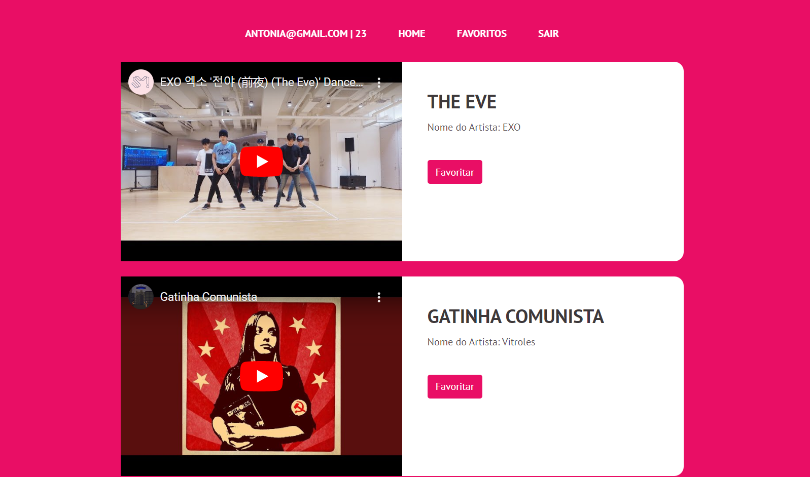
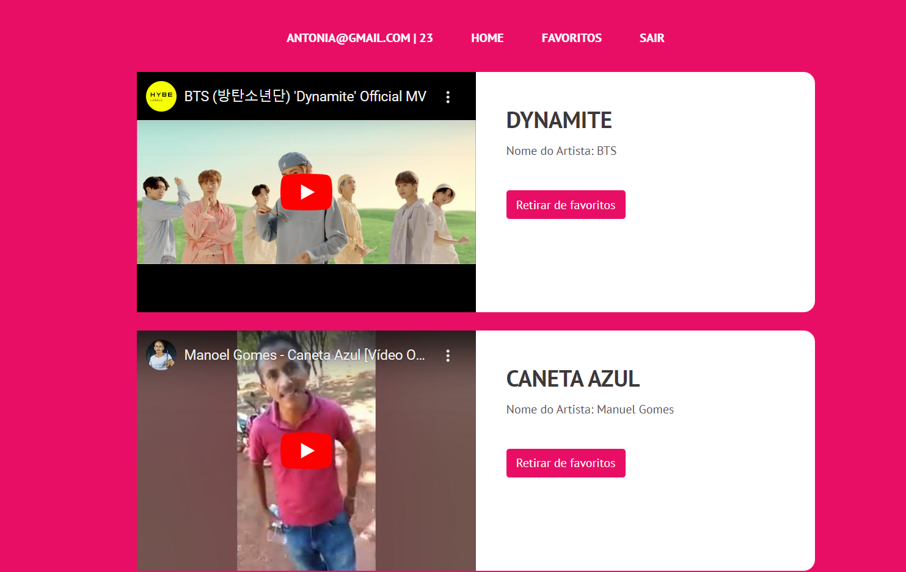

#  🖥️ **Projeto em PHP e MySQL**

## 📋 **Sobre o Projeto** 

- Esse é um projeto para o TCC de *Desenvolvimento de Sistemas.*

- O usuário pode *assistir, favoritar e desfavoritar* conteúdos adicionados pelo administrador.

- Ou seja, administradores utilizam a plataforma para gerenciar o sistema: *Gerenciando conteúdo, contas e muito mais.*
 
- O desafio principal do projeto consiste em conciliar os conhecimentos de **Desenvolvimento Web** com **Banco de Dados (MySQL)**

## ⚙️ Ferramentas utilizadas:
- Visual Studio Code
- BootStrap
- WAMP
- EasyPHP
- phpMyAdmin
- MySQL Workbench
- Google Drive
- Youtube

## 💾 Linguagens utilizadas:
- PHP
- MySQL
- HTML
- CSS
- JavaScript

 

## Imagens do Projeto

- #### TELA DE LOGIN / CADASTRO

- #### TELA INICIAL

- #### TELA FAVORITOS

## Contato:
 Nome: Andrey da Silva Pereira
- GitHub: [andreypereira08](https://github.com/andreypereira08)
- Email: [andrey08.ap@gmail.com](mailto:andrey08.ap@gmail.com)
- Linkedin: [Andrey Pereira](https://www.linkedin.com/in/andrey-pereira-b92a36224/)

